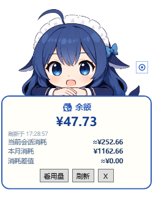
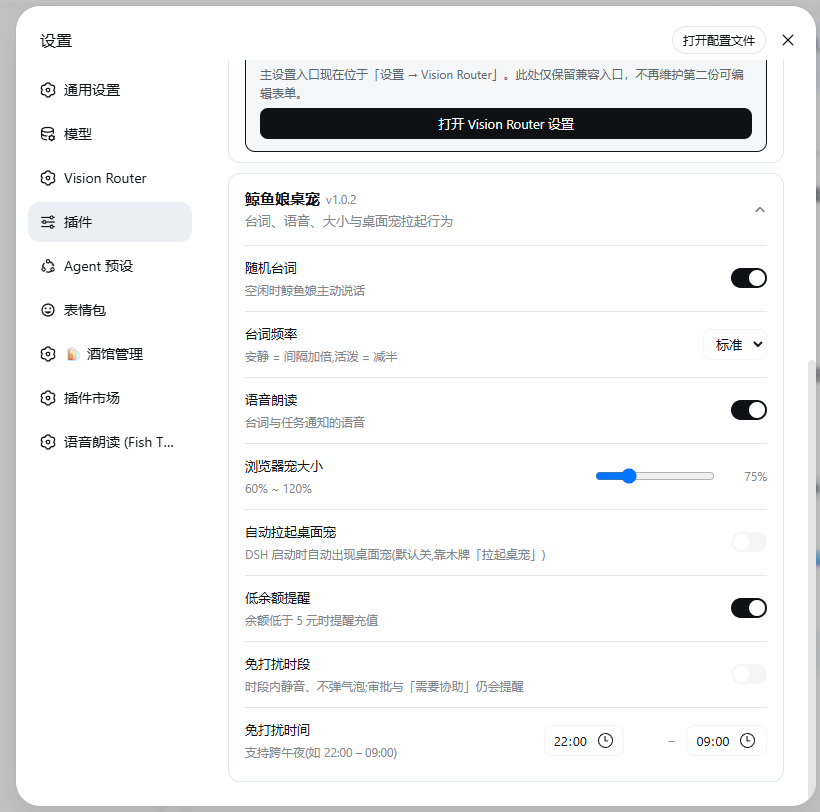

# 🐳 dsh-whale-pet · 鲸鱼娘桌宠

为 **DeepSeek Harness (DSH)** 而生的陪伴型桌宠:浏览器右下角的悬浮鲸鱼娘 + Windows 置顶桌面宠,**双形态共享同一份数据**,把余额、任务、消耗和陪伴都放在手边。

[](https://awesome-dsh-plugin.com)
[](https://www.npmjs.com/package/dsh-whale-pet-plugin)
[](./LICENSE)

## ✨ 功能一览

- 🪵 **余额木牌**:DeepSeek 实时余额 + 当前会话消耗 + 本月消耗(平台真实账单)+ 消耗差值,一键刷新;Token 用量视图(调用/输入/输出/缓存)
- 🔔 **任务通知**:会话/子任务/工作流/后台任务完成、失败、等待审批、需要协助时,木牌弹通知 + 语音播报(三变体随机);完成通知带本次任务的真实成本
- 🫳 **摸头互动**:鼠标停在鲸鱼娘头上 → 害羞贴纸 + 爱心 + 摸头台词
- 🎙️ **19 句带情感台词**:每句配专属语气,预合成语音随包分发,离线可用、零 TTS 调用
- 🖥️ **Windows 桌面宠**:置顶 WPF 小窗(立绘 + 木牌),与浏览器宠同步台词与通知;眼睛按钮进入透明模式(**鼠标穿透**),悬停眼睛可退出
- 🌙 **免打扰时段**:设定静音时段(支持跨午夜),只静音不消失;审批与「需要协助」白名单照常提醒
- 💸 **低余额提醒**:余额低于 5 元弹提醒,内置充值二维码流程
- ⚙️ **设置面板**:随机台词开关/频率、语音开关、宠物大小、自动拉起、免打扰……全部可在「设置 → 插件 → 鲸鱼娘桌宠」里改
- 🔒 **零遥测**:所有数据只存本机,语音与立绘全部随包内置

## 📸 截图

**浏览器桌宠 · 余额木牌**(实时余额 / 会话消耗 / 本月消耗 / 消耗差值)


**浏览器桌宠 · 用量视图**(模型调用次数 / 输入 / 输出 / 缓存 tokens)


**摸头互动**(害羞贴纸 + 爱心 + 台词)


**Windows 桌面宠**(置顶木牌 + 台词 + 通知)



**设置面板**(台词 / 语音 / 大小 / 免打扰……)



## 📦 安装

```sh
# 推荐:npm(预构建,免 allowBuilds 授权)
dsh plugin --profile web add dsh-whale-pet-plugin

# 或从 GitHub 安装
dsh plugin add github:dleaf6211-hash/dsh-whale-pet
```

安装后重启 Harness(或对应 profile),浏览器右下角就会出现鲸鱼娘。桌面宠默认**不自动拉起**——点木牌上的「拉起桌宠」按需启动,或在设置里打开「自动拉起桌面宠」。

## 🎮 使用

| 交互 | 效果 |
|---|---|
| 停在鲸鱼娘头部 ~0.7 秒 | 摸头:害羞贴纸 + 爱心 + 摸头台词 |
| 木牌「看用量 / 看余额」 | 余额与 Token 用量切换 |
| 木牌「拉起桌宠」 | 拉起/查看桌面宠(运行中只提示,不会误关) |
| 木牌「刷新」 | 立即拉取最新余额 |
| 桌面宠右上角 👁 | 透明模式(鼠标穿透),悬停眼睛再点退出 |
| 输入框…… | 什么都不用做,它会自己冒台词 💬 |

## ⚙️ 设置项

「设置 → 插件 → 鲸鱼娘桌宠」:

| 设置 | 说明 | 生效 |
|---|---|---|
| 随机台词 | 空闲时主动说话的开关 | 立即 |
| 台词频率 | 安静(间隔×2)/ 标准 / 活泼(×0.5) | 立即 |
| 语音朗读 | 台词与通知语音总开关 | 立即 |
| 浏览器宠大小 | 60% ~ 120% | 立即 |
| 自动拉起桌面宠 | 默认关 | 下次重启 |
| 低余额提醒 | 余额 < 5 元弹提醒 | 立即 |
| 免打扰时段 | 静音 + 不弹气泡;审批/需要协助白名单 | 立即 |

## ❓ 常见问题

**升级插件时报 `EPERM rename node_modules\dsh-whale-pet-plugin`?**
桌宠进程锁着插件目录。先托盘/按钮退出桌面宠 → 完全退出 DSH → 再执行 `dsh plugin add` → 重启。

**关掉桌面宠后没声音了?**
发声权会自动交还浏览器宠(心跳检测,最多 ~15 秒)。

**为什么账单和余额对不上?**
本月消耗优先取平台真实账单(本机已有平台登录凭据时);「消耗差值」= 今日余额起点 − 当前余额 − 会话消耗,为负时显示 0。

**不想被它吵?**
打开免打扰时段;审批与「需要协助」仍会提醒你,不会错过关键事。

## 🔒 数据与隐私

- 余额查询使用本机 `~/.dsh/.credentials.yaml` 中的 DeepSeek API Key,直连 `api.deepseek.com`,不经过任何第三方
- 真实月度账单仅在检测到本机平台登录凭据(`~/.whale-platform-auth.json`)时拉取,无凭据则用 token 估算
- 台词语音全部为仓库内置预合成音频,运行时不调用任何 TTS 服务
- 所有状态保存在本机 `~/.whale-pet/` 与 `~/.whale-*.json`,**无任何遥测上报**

## 🖥️ 系统要求

- Windows(桌面宠基于 PowerShell + WPF;浏览器宠任意系统可用)
- DeepSeek Harness (dsh)

## 🐛 问题反馈

欢迎任何反馈!到 [Issues](https://github.com/dleaf6211-hash/dsh-whale-pet/issues) 提交(有现成模板)。**请务必注明你的 DSH 宿主版本**(`npm ls @deepseek-ai/dsh`)——不同宿主版本的 API 差异会影响问题定位,注明版本能让我们少绕很多弯路。

## 📄 License

MIT
